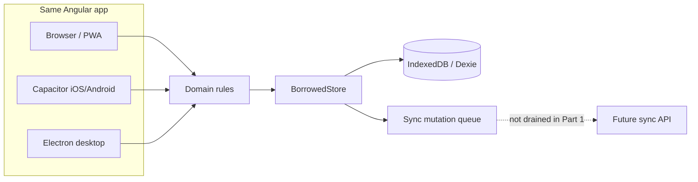

# Architecture

Borrowed is a **local-first personal app** with one Angular frontend. Native shells wrap that frontend. There is no application server in Part 1.

## Layers

1. **UI** (`src/app/features`, `src/app/layout`) — screens, navigation, i18n strings. No outstanding-balance math.
2. **Application** (`src/app/data/borrowed-app.ts`) — use cases: create loan, repay, mark returned. Writes locally, enqueues a sync mutation.
3. **Domain** (`src/app/domain`) — pure TypeScript. IDs, money, calendar dates, status rules. No Dexie, no Angular.
4. **Persistence** (`src/app/data`) — Dexie implements `BorrowedStore`. IndexedDB is the web/PWA/WebView database.

UI components inject `BorrowedApp`, not Dexie.

## Frontend

- Angular 22 standalone components, signals, zoneless change detection
- Router for primary areas
- No NgRx. Screen state is signals plus the Dexie-backed app service
- Feature folders: `home`, `lent`, `borrowed`, `add`, `loan-detail`, `history`, `people`, `settings`, `more`

## Backend

None in Part 1. Sync, accounts, and file backup are specified in `docs/sync.md` and deferred.

## Local database

Dexie over IndexedDB. Schema version 1. Migrations go through Dexie `version().stores()` / `upgrade()`.

Native SQLite (Capacitor community SQLite / Electron `better-sqlite3`) is **not** used yet. The store interface is the seam. See ADR 0003.

## Remote database

None.

## Synchronization

Writes append to a local mutation queue with client-generated IDs. Nothing is uploaded in Part 1. The queue exists so later sync does not require a rewrite. See `docs/sync.md`.

## Authentication

Local-only. A `localIdentityId` is generated on first run and stored in settings. No password, no session. Synced accounts are a future, separate identity. See ADR 0004.

## Attachments

Not implemented. Loans do not require photos. Future attachments must not block loan creation if upload fails (`docs/roadmap.md`).

## Notifications

Not implemented. Permission will be requested only when the user creates a reminder.

## Platform integrations

| Platform  | Role                                                                        |
| --------- | --------------------------------------------------------------------------- |
| Browser   | Primary development target, `http://127.0.0.1:4200`                         |
| PWA       | Installable web app, same origin, same IndexedDB                            |
| Capacitor | Same web build in a native WebView. Plugins behind `src/app/platform` later |
| Electron  | Desktop window loading the local Angular URL in development                 |

Capacitor plugin calls must not appear in domain or feature components. Wrap them when the first native capability is added.

## Error boundaries

- Domain throws typed `DomainError` (`validation`, …)
- UI maps those to i18n messages
- Persistence failures surface as “Couldn’t save on this device” — the form is not cleared
- There is no network path for core actions

## Testing architecture

- Vitest unit tests for domain (no Angular)
- Vitest tests for Dexie store using `fake-indexeddb`
- Component tests for the shell where useful
- E2E is deferred until the add/return flows are stable

## Versioning

| Version       | Where                                           |
| ------------- | ----------------------------------------------- |
| Application   | `package.json`                                  |
| Local schema  | Dexie version / `LocalSettings.schemaVersion`   |
| API           | Not applicable yet                              |
| Sync protocol | Documented as v0 (queue only) in `docs/sync.md` |
