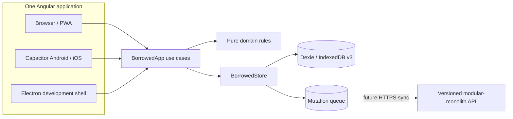

# Architecture

Borrowed is a local-first personal application with one Angular frontend. Web/PWA, Android, iOS and desktop reuse the same domain and UI. There is no application server in Part 1.

## Runtime layers

1. `src/app/features`, `layout`, `ui`, `i18n`: routes, components, accessible interaction and localizable copy. They do not calculate balances or write Dexie directly.
2. `src/app/data/borrowed-app.ts`: application use cases and presentation-shaped reads.
3. `src/app/domain`: pure TypeScript types, commands, money/date/status/query rules and IDs.
4. `src/app/data`: `BorrowedStore`, Dexie adapter, rows/mappers and schema migrations.
5. `capacitor.config.ts`, `android/`, `ios/`, `electron/`: delivery shells. Native APIs must be wrapped at this boundary before features use them.

Dependencies point inward. Domain code has no Angular, Dexie, Capacitor or Electron import.

## Frontend

- Angular 22 standalone components, strict templates, signals and zoneless change detection.
- No NgRx: local persisted state is authoritative; signals hold screen state and the application revision marker.
- Feature routes are lazy loaded. The shell is eager so navigation and the first landmark appear quickly.
- One flow is used at all widths. Mobile uses a five-item bottom navigation; desktop uses a rail and wider content area.
- User text comes from self-contained EN/RU/LT locale files. `catalog.ts` derives supported languages and selector metadata; English is the fallback and structural reference. Named parameters and `Intl.PluralRules` handle grammar without concatenating translated fragments. See `docs/i18n.md`.
- The add form keeps one device-local draft and clears it only after a successful committed record.

## Local persistence

Dexie/IndexedDB schema v3 is the only implemented store on all shells. It supports indexed queries, transactions, persistence, language preference and migrations; `localStorage` is not a database.

The critical loan update boundary is `BorrowedStore.updateLoan()`. It reads the loan and repayments, validates the domain command, writes the new loan/event/repayment and enqueues mutations in one read-write transaction. This prevents two tabs from accepting conflicting repayments against one stale balance.

Native SQLite is not claimed. If WebView persistence proves insufficient, a SQLite implementation can replace the adapter without changing domain/UI contracts. That migration must include data transfer and rollback, not require reinstalling the app.

## PWA and offline behavior

The production web build registers Angular’s service worker and prefetches the application shell and hashed JS/CSS. IndexedDB holds user data. The service worker is disabled inside Capacitor because the native package already ships its web assets and does not need a second cache lifecycle.

Core create, view, search, return, repay, deadline tracking/change, history and settings operations perform no HTTP request. The PWA can reload its cached shell offline after one successful online production load.

People remain local domain records rather than authenticated identities. The list performs one bounded people read and one bounded loans read for recent ordering/counts. A detail route performs one Person lookup, one indexed `personId` Loan read and at most one batched Repayment read, then the pure `summarizePersonRelationships()` function derives direction groups, physical-item counts, per-currency balances, remaining amounts and history.

`dueOn` remains date-only source data. `calendarDaysBetween()` derives exact relative distance from the user's local today, and the shared `DueStatus` component renders the same EN/RU/LT reminder on Home, lists and Details. `CurrentDayTracker` advances a single reactive day signal at local midnight and refreshes it on window focus or restored page visibility, so an open screen does not keep yesterday's reminder. No stale overdue flag is stored.

## Backend and remote database

None exists in Part 1. The future backend is a versioned API in a modular monolith responsible only for authentication, backup/sync, device management, files and notification delivery. It must expose DTOs/resources, not ORM rows. See `docs/sync.md`.

## Authentication and identity

First run creates `LocalSettings.localIdentityId`. This installation identity is not an authenticated account. Records work with no account. A future account links installations at the sync layer and must not make Person equal to registered User.

## Attachments and notifications

In-app due-date reminders are implemented without permissions: the app shows today/tomorrow/in-days and exact overdue duration whenever active records are rendered. Moving a deadline uses the same atomic `BorrowedStore.updateLoan()` boundary as return and repayment, appending `due_date_changed` history and sync mutations.

A future attachment service has independent local metadata/blob/upload state so photo failure never rolls back a loan. User-configured operating-system notifications remain a separate Reminder entity and scheduler from `dueOn`; permissions are requested only when the user explicitly enables one. The app never contacts the counterparty automatically.

## Platform integrations

Capacitor calls are confined to delivery/bootstrap boundaries. A future camera, notification, contacts, secure-storage or biometrics feature first defines a small application interface and then web/Android/iOS adapters. Feature components never branch on an operating system.

## Error boundaries

| Boundary               | Behavior                                                                         |
| ---------------------- | -------------------------------------------------------------------------------- |
| Domain validation      | Typed `DomainError` code, translated to actionable UI copy                       |
| Missing local row      | Generic non-private “not found” state                                            |
| Draft persistence      | Best-effort and non-blocking; committed save still reports local storage failure |
| Local database failure | Form remains populated; generic retry message, no raw exception                  |
| Network/sync           | Not present; future states are Synced, Syncing, Offline, Needs attention         |
| Global runtime         | Angular global browser error listeners; no private payload logging               |

## Testing architecture

- Pure Vitest tests for domain rules.
- fake-indexeddb integration tests for transactions, persistence, migration, drafts and reload.
- Angular TestBed component tests for navigation, accessibility contracts and core views.
- Production build inspection and real-browser PWA/offline/responsive acceptance.
- CI also compiles a Capacitor Android debug APK with Java 21/API 36.

## Version boundaries

| Version          | Current source                                           |
| ---------------- | -------------------------------------------------------- |
| Application      | `package.json` (`0.1.0`)                                 |
| IndexedDB schema | `LOCAL_SCHEMA_VERSION` (`3`)                             |
| Sync protocol    | v0 queue-only design in `docs/sync.md`                   |
| API              | Not implemented; first remote contract will be `/api/v1` |
| Native shells    | Capacitor packages and native project files (`8.5`)      |

Older clients and a future newer backend must coexist. Remote breaking changes require a new API/protocol version and a documented compatibility window.
